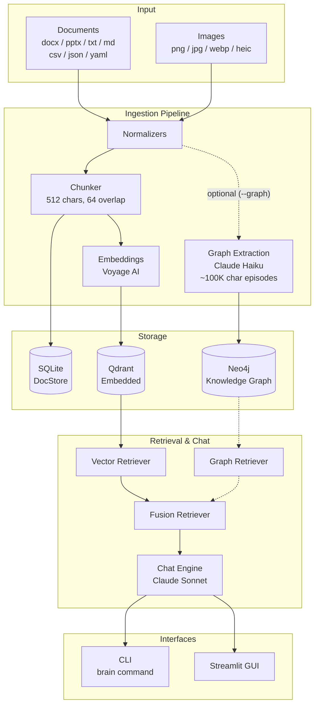
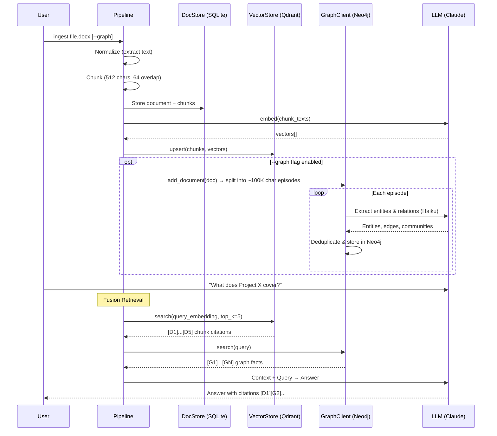
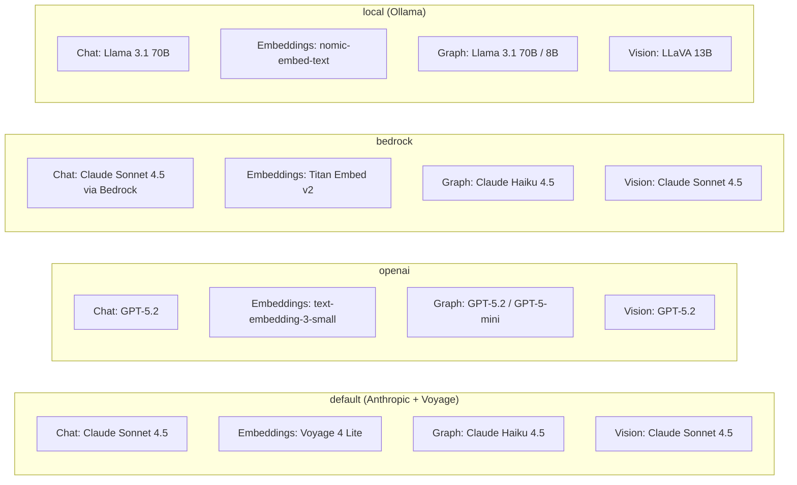

# Second Brain

A local "second brain" system that ingests documents, builds a vector index and knowledge graph, and lets you chat with your knowledge base through a Streamlit GUI or CLI. Powered by pluggable LLM backends via [LiteLLM](https://github.com/BerriAI/litellm) and [Graphiti](https://github.com/getzep/graphiti) for Neo4j-based knowledge graph construction.

## Architecture



## Data Flow



## Prerequisites

- **Python** >= 3.10 (tested with 3.13)
- **Neo4j Desktop** >= 5.26 with a running instance
- **API Keys**: `ANTHROPIC_API_KEY` and `VOYAGE_API_KEY`

## Installation

```bash
# Create conda environment
conda create -n brain python=3.13 -y
conda activate brain

# Install in editable mode
pip install -e ".[dev]"
```

### API Keys

Create a `.env` file in the project root (gitignored automatically):

```bash
# .env
ANTHROPIC_API_KEY=sk-ant-...
VOYAGE_API_KEY=pa-...
```

Or export them directly:

```bash
export ANTHROPIC_API_KEY="sk-ant-..."
export VOYAGE_API_KEY="pa-..."
```

The `.env` file is loaded automatically when brain starts. Shell env vars take precedence over `.env` values.

Verify the installation:

```bash
brain doctor
```

## Quick Start

```bash
# 1. Ingest some documents
brain ingest ./data/watched          # Ingest a folder
brain ingest ./report.docx           # Ingest a single file
brain ingest ./slides.pptx --force   # Re-ingest even if unchanged

# 2. Chat with your knowledge base
brain chat "What are the key findings in the report?"
brain chat "Summarize the project deck" --top-k 10

# 3. Enable graph-enhanced retrieval (requires Neo4j)
brain ingest ./report.docx --graph      # Ingest with knowledge graph extraction
brain chat "What entities are connected to Project X?" --graph

# 4. Knowledge graph management
brain graph stats                                      # Show node/relationship counts
brain graph clear --confirm "delete all graph data"    # Delete entire graph (safety phrase required)

# 5. JSON output for scripting
brain chat "List all topics" --json
```

## CLI Reference

```
brain [OPTIONS] COMMAND [ARGS]

Options:
  --json           Output as JSON (agent-friendly)
  --profile, -p    Override active LLM profile
  --root           Override project root directory

Commands:
  doctor   Check system health and connectivity
  ingest   Ingest documents into the second brain
  chat     Chat with your second brain
  graph    Knowledge graph management (stats, clear)
```

### `brain doctor`

Runs 6 health checks: config loading, environment variables, data directories, Neo4j connectivity, LLM completion, and embedding generation.

### `brain ingest <path>`

| Option | Description |
|--------|-------------|
| `path` | File or folder to ingest |
| `--graph`, `-g` | Extract knowledge graph via Neo4j/Graphiti |
| `--force`, `-f` | Re-ingest even if content hash hasn't changed |

Supported formats: `.docx`, `.pptx`, `.txt`, `.md`, `.csv`, `.json`, `.yaml`, `.yml`, `.png`, `.jpg`, `.jpeg`, `.webp`, `.heic`

Images are processed through LLM-based OCR (Claude vision model) for text extraction.

### `brain chat <query>`

| Option | Description |
|--------|-------------|
| `query` | Your question |
| `--top-k` | Number of retrieved chunks (default: 5) |
| `--graph / --no-graph` | Enable graph-enhanced retrieval (default: off) |
| `--json` | Output as JSON |

### `brain graph`

| Subcommand | Description |
|------------|-------------|
| `stats` | Show node and relationship counts in the knowledge graph |
| `clear --confirm "delete all graph data"` | Delete all nodes and relationships (requires exact safety phrase) |

## Streamlit GUI

```bash
streamlit run src/brain/ui/app.py
```

The web interface provides five tabs:

| Tab | Description |
|-----|-------------|
| **Chat** | Conversational interface with citation panel and graph facts expander |
| **Ingest** | File upload, watched folder trigger, live log streaming, graph extraction checkbox |
| **Graph** | Search the knowledge graph, node/relationship stats, danger zone clear with safety phrase |
| **Jobs / Logs** | Document, chunk, and vector metrics |
| **Settings** | Active profile viewer, connection status, health checks |

## Configuration

Configuration loads with the following priority (highest first):

```
Environment variables (BRAIN_ prefix) > .env file > config.yaml > config.default.yaml
```

### Environment Variables

All settings can be overridden via env vars with the `BRAIN_` prefix and `__` as the nested delimiter:

```bash
export BRAIN_ACTIVE_PROFILE=openai
export BRAIN_NEO4J__URI=bolt://remote-host:7687
export BRAIN_NEO4J__PASSWORD=secret
export BRAIN_CHUNKER__CHUNK_SIZE=1024
```

### User Config

Create `config.yaml` in the project root to override defaults (this file is gitignored):

```yaml
active_profile: default

neo4j:
  password: "my-custom-password"

watched_folders:
  - "./data/watched"
  - "/path/to/my/documents"

chunker:
  chunk_size: 1024
  chunk_overlap: 128
```

### LLM Profiles

Four profiles ship out of the box. Switch between them via `active_profile` in config or `--profile` on the CLI.



| Profile | Chat Model | Embed Model | Graph Extraction | Vision |
|---------|-----------|-------------|-----------------|--------|
| `default` | `anthropic/claude-sonnet-4-5-20250929` | `voyage/voyage-4-lite` (1024d) | `anthropic/claude-haiku-4-5-20251001` | `anthropic/claude-sonnet-4-5-20250929` |
| `openai` | `openai/gpt-5.2` | `openai/text-embedding-3-small` (1536d) | `openai/gpt-5-mini` | `openai/gpt-5.2` |
| `bedrock` | `bedrock/anthropic.claude-sonnet-4-5-20250929-v1:0` | `bedrock/amazon.titan-embed-text-v2:0` (1024d) | `bedrock/anthropic.claude-haiku-4-5-20251001-v1:0` | `bedrock/anthropic.claude-sonnet-4-5-20250929-v1:0` |
| `local` | `ollama/llama3.1:70b` | `ollama/nomic-embed-text` (768d) | `ollama/llama3.1:8b` | `ollama/llava:13b` |

## Project Structure

```
brain/
├── pyproject.toml                  # Build config, dependencies, CLI entrypoint
├── config.default.yaml             # Shipped defaults (checked in)
├── config.yaml                     # User overrides (gitignored)
├── data/                           # Runtime data (gitignored)
│   ├── qdrant/                     # Qdrant embedded storage
│   ├── docstore.db                 # SQLite document + chunk metadata
│   └── watched/                    # Default watched folder
├── src/brain/
│   ├── config.py                   # Pydantic Settings + YAML profiles
│   ├── llm.py                      # LiteLLM wrapper (complete, embed, transcribe_image)
│   ├── models.py                   # Domain models: Document, Chunk, Citation
│   ├── ingest/
│   │   ├── normalizers.py          # docx, pptx, txt, image text extractors
│   │   ├── chunker.py              # Recursive structure-aware chunker
│   │   └── pipeline.py             # Orchestrator: normalize → chunk → embed → graph
│   ├── stores/
│   │   ├── docstore.py             # SQLite document & chunk metadata
│   │   └── vectorstore.py          # Qdrant embedded vector store
│   ├── graph/
│   │   ├── bridge.py               # Config → Graphiti client translation layer
│   │   └── client.py               # Graphiti lifecycle (init, add_episode, search)
│   ├── chat/
│   │   ├── retriever.py            # Vector + graph fusion retriever
│   │   └── engine.py               # RAG chat engine with dual citations
│   ├── cli/
│   │   ├── app.py                  # Typer entrypoint, global options
│   │   ├── doctor.py               # brain doctor — health checks
│   │   ├── ingest_cmd.py           # brain ingest <path> [--graph] [--force]
│   │   ├── graph_cmd.py            # brain graph {stats, clear}
│   │   └── chat_cmd.py             # brain chat "question"
│   └── ui/
│       ├── app.py                  # Streamlit entry, 5-tab layout
│       ├── tab_chat.py             # Chat with citations + graph facts
│       ├── tab_ingest.py           # File upload + watched folders
│       ├── tab_graph.py            # Knowledge graph search + stats + clear
│       ├── tab_jobs.py             # Ingestion metrics
│       └── tab_settings.py         # Profile viewer + health checks
└── tests/
    ├── conftest.py                 # Fixtures, tmp dirs, settings reset
    ├── test_config.py
    ├── test_llm.py
    ├── test_normalizers.py
    ├── test_chunker.py
    ├── test_docstore.py
    ├── test_vectorstore.py
    ├── test_graph_bridge.py
    └── test_chat_engine.py
```

### Graph Extraction

Knowledge graph extraction uses [Graphiti](https://github.com/getzep/graphiti) to build a Neo4j graph from document text. Key settings in `config.default.yaml`:

| Setting | Default | Description |
|---------|---------|-------------|
| `graph.episode_size` | `100000` | Max chars per Graphiti episode (~25K tokens). Large documents are automatically split. |
| `graph.max_coroutines` | `3` | Max parallel LLM calls inside Graphiti. Default of 20 is too aggressive for API rate limits. |
| `graph.episode_delay` | `15` | Seconds to pause between episodes for rate limit cooldown. |

Even with throttled concurrency, Graphiti makes many internal LLM calls per episode (entity extraction, deduplication, edge extraction, community detection). Expect some rate limit retries on large documents — Graphiti's built-in exponential backoff handles these automatically.

## Key Design Decisions

**LiteLLM for app code, native clients for Graphiti.** The app's `llm.py` uses LiteLLM to call Anthropic (chat) and Voyage AI (embeddings) through a single interface. Graphiti uses its own `AnthropicClient` and `VoyageAIEmbedder`, configured through `graph/bridge.py`. This avoids fighting Graphiti's internal structured output requirements.

**No provider directory.** LiteLLM *is* the provider abstraction. `llm.py` is a single file with three async functions — `complete()`, `embed()`, and `transcribe_image()`.

**Async throughout.** All core functions are async. The CLI and Streamlit bridge with `asyncio.run()`.

**Embedded datastores.** Qdrant runs in embedded mode (no server process). SQLite stores document metadata. Only Neo4j requires a running server.

**Graph extraction is non-fatal.** If Neo4j is unavailable or graph extraction fails, vector retrieval still works. The pipeline wraps graph operations in try/except.

**Dual citation system.** Chat responses cite both document chunks (`[D1]`...`[DN]`) and knowledge graph facts (`[G1]`...`[GN]`), giving the user traceability into both retrieval sources.

## Development

```bash
# Install dev dependencies
pip install -e ".[dev]"

# Run tests (55 tests)
pytest

# Run with coverage
pytest --cov=brain

# Lint
ruff check src/ tests/
ruff format src/ tests/
```
